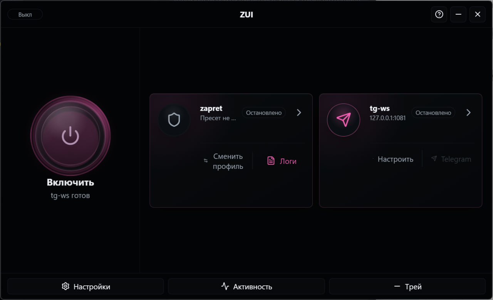

<p align="center">
  
</p>

<h1 align="center">ZUI</h1>

<p align="center">
  <strong>GUI для zapret • тестирование пресетов • встроенный tg-ws • автообновления</strong>
</p>

<p align="center">
  <a href="https://github.com/AmantesNihilo/zapret-universal-interface/releases">
    
  </a>
  
  
  
</p>

<p align="center">
  
  
  
  
  
</p>

<p align="center">
  <a href="#скачать">Скачать</a>
  ·
  <a href="#быстрый-старт">Быстрый старт</a>
  ·
  <a href="#скриншоты">Скриншоты</a>
  ·
  <a href="#известные-ограничения">Ограничения</a>
  ·
  <a href="#troubleshooting">Troubleshooting</a>
  ·
  <a href="#сборка-из-исходников">Сборка</a>
</p>

<p align="center">
  
</p>

ZUI - современная Windows-утилита для запуска `zapret`, выбора пресетов, проверки их работоспособности и управления встроенным `tg-ws`.

Она подойдет пользователям Windows, которым нужен удобный GUI для `zapret` без ручного запуска `.bat`-файлов, лишних окон и постоянного копания в папках. По сравнению с Z2 GUI, новая версия переписана на Tauri/Rust/Svelte, быстрее запускается, аккуратнее управляет сервисами и умеет проверять обновления через GitHub Releases.

> [!IMPORTANT]
> ZUI не является VPN. Приложение не шифрует весь трафик, не скрывает IP-адрес, не меняет регион и не делает подключение анонимным.

> [!NOTE]
> ZUI активно развивается. Баг-репорты и предложения приветствуются через GitHub Issues.
>

## Скачать

Актуальные сборки публикуются на странице релизов:

**https://github.com/AmantesNihilo/zapret-universal-interface/releases**

| Файл                    | Что выбрать                                                                   |
| --------------------------- | --------------------------------------------------------------------------------------- |
| `ZUI_2.0.0_x64-setup.exe` | Рекомендуемый вариант для обычной установки      |
| `ZUI_2.0.0_x64_en-US.msi` | MSI-пакет для ручной или корпоративной установки |
| `ZUI_2.0.0_portable.zip`  | Portable-версия без установки                                         |
| `SHA256SUMS.txt`          | Хэши для проверки целостности файлов                    |

> [!TIP]
> Если не знаете, что выбрать, скачивайте `ZUI_2.0.0_x64-setup.exe`.

## Для кого это

ZUI подойдет, если вы:

- используете Windows 10/11 и хотите запускать `zapret` через понятный интерфейс;
- не хотите вручную выбирать и запускать `.bat`-файлы;
- хотите быстро понять, какой пресет работает лучше;
- используете Telegram и хотите встроенный `tg-ws` без отдельной иконки в трее;
- хотите видеть логи, диагностику и состояние сервисов в одном месте.

## Возможности

| Быстрый запуск                                                | Тесты пресетов                                                                | Встроенный tg-ws                                       |
| -------------------------------------------------------------------------- | ------------------------------------------------------------------------------------------ | ---------------------------------------------------------------- |
| Один главный action для запуска и остановки | Быстрый тест, полный тест и поиск лучшего пресета | Без отдельного внешнего `tg-ws-proxy.exe` |

| Темы                    | Обновления                                   | Пресеты                                                        |
| --------------------------- | ------------------------------------------------------ | --------------------------------------------------------------------- |
| OLED, Dark, Light и System | Проверка GitHub Releases при запуске | Поиск, избранное, скрытие и свои папки |

<details>
<summary>Полный список возможностей</summary>

- запуск и остановка `zapret` из главного окна;
- отдельные карточки `zapret` и `tg-ws`;
- запуск только выбранных сервисов;
- базовые пресеты из `Flowseal/zapret-discord-youtube`;
- подключение пользовательских папок с пресетами;
- поиск, избранное и скрытие ненужных пресетов;
- фильтрация служебных файлов вроде `service`, `blockcheck`, `utils`, `cygwin-admin`;
- быстрый тест выбранного пресета;
- полный тест всех видимых подходящих пресетов;
- поиск лучшего пресета;
- подробные результаты по Discord, YouTube, Google и Cloudflare;
- диагностика прав администратора, ресурсов, `winws.exe`, порта `tg-ws` и количества пресетов;
- обнаружение конфликтующих приложений перед запуском;
- логи приложения, `zapret`, `tg-ws` и тестов;
- русская и английская локализация;
- вертикальное и горизонтальное окно;
- темы OLED, Dark, Light и System;
- набор акцентных цветов;
- управление из трея;
- проверка обновлений через GitHub Releases.

</details>

## Скриншоты

| Главное окно                                                          | Вертикальный режим                                          |
| -------------------------------------------------------------------------------- | ---------------------------------------------------------------------------- |
| `` | `` |

| Остановка теста                                              |
| -------------------------------------------------------------------------- |
| `` |

## Быстрый старт

1. Скачайте и установите `ZUI_2.0.0_x64-setup.exe`.
2. Запустите ZUI от имени администратора.
3. Откройте `Настройки -> Проверки` и убедитесь, что ресурсы найдены.
4. Запустите проверку пресетов и дождитесь результатов
5. Выберите пресет.
6. Вернитесь на главный экран и нажмите кнопку питания.

Для Telegram proxy:

1. Включите `tg-ws` во вкладке `Сервисы`.
2. Проверьте host, port и secret.
3. Запустите сервис.
4. Нажмите кнопку Telegram, когда она станет активной.

> [!WARNING]
> Для запуска `zapret` нужны права администратора. Без них часть пресетов может не стартовать.

## Пресеты и тесты

ZUI тестирует только подходящие исполняемые пресеты. Служебные папки и вспомогательные файлы не участвуют в прогоне.

| Режим              | Что делает                                                                    |
| ----------------------- | -------------------------------------------------------------------------------------- |
| Быстрый тест | Проверяет выбранный пресет                                     |
| Тест всех       | Проверяет все видимые подходящие пресеты           |
| Найти лучший | Прогоняет кандидатов и сортирует рекомендации |

После теста видно:

- процент успешных проверок;
- сколько таргетов прошло;
- какие проверки упали;
- длительность запросов;
- группировку по Discord, YouTube, Google и Cloudflare;
- кнопку применения подходящего пресета.

> [!NOTE]
> Тесты помогают выбрать пресет, но не являются абсолютной истиной. Реальная работа Discord, YouTube или Telegram может отличаться от результата отдельных сетевых запросов.

## Известные ограничения

- ZUI не является VPN и не обеспечивает анонимность.
- ZUI не гарантирует работу всех сервисов во всех сетях.
- Для `zapret` требуются права администратора.
- Возможны предупреждения антивирусов из-за `winws`, WinDivert и работы с сетевыми пакетами.
- Portable-версия не обновляется автоматически: она только сообщает о новой версии и открывает страницу релиза.
- Результаты тестов пресетов зависят от сети, провайдера, DNS и текущей доступности таргетов.

## Безопасность

Так как ZUI работает с сетевыми инструментами, соблюдайте базовые правила:

- скачивайте сборки только из официальных GitHub Releases;
- проверяйте `SHA256SUMS.txt` перед запуском новой версии;
- не запускайте неизвестные пересобранные `.exe` из сторонних источников;
- не добавляйте пользовательские пресеты, если не понимаете, что внутри `.bat`/`.cmd`;
- перед публикацией своих сборок проверяйте лицензии включенных компонентов.

## tg-ws

В ZUI используется встроенный Rust-порт `tg-ws`, основанный на оригинальном проекте [Flowseal/tg-ws-proxy](https://github.com/Flowseal/tg-ws-proxy).

Что это дает:

- отдельный внешний `tg-ws-proxy.exe` не запускается;
- отдельной иконки tg-ws в трее нет;
- состояние контролируется самим ZUI;
- secret отображается так, как будет использован при запуске;
- Telegram-ссылка доступна только когда proxy включен и готов.

## Системные требования

| Требование | Значение                                                        |
| -------------------- | ----------------------------------------------------------------------- |
| ОС                 | Windows 10 / Windows 11 x64                                             |
| Права           | Администратор для запуска `zapret`             |
| WebView              | Microsoft Edge WebView2 Runtime                                         |
| Сеть             | Нужна для тестов и проверки обновлений |

## Установка

### Обычная версия

1. Скачайте `ZUI_2.0.0_x64-setup.exe`.
2. Запустите установщик.
3. Откройте ZUI.
4. Проверьте вкладку `Настройки -> Проверки`.

Данные установленной версии хранятся в профиле пользователя Windows.

### Portable-версия

1. Скачайте `ZUI_2.0.0_portable.zip`.
2. Распакуйте архив в отдельную папку.
3. Запустите `ZUI.exe`.
4. Оставьте `portable.flag` рядом с `ZUI.exe`, чтобы приложение работало в portable-режиме.

Portable-версия хранит данные рядом с приложением и не устанавливает обновления автоматически.

## Где хранятся данные

Установленная версия:

```text
%APPDATA%\ZUI\
  settings.json
  profiles.json
  preset-preferences.json
  test-results.json
  logs\
```

Portable-версия:

```text
<папка portable>\data\
  settings.json
  profiles.json
  preset-preferences.json
  test-results.json
  logs\
```

Эти файлы являются локальными пользовательскими данными.

## Troubleshooting

### Не найден `winws.exe`

Откройте `Настройки -> Проверки` и проверьте путь к ресурсам. В установленной или portable-сборке должна быть папка `resources/zapret` с базовыми файлами `zapret`.

### Нет прав администратора

Запустите ZUI от имени администратора. Для `zapret` это обязательное условие, потому что он работает с сетевыми правилами и пакетами.

### Порт `tg-ws` занят

Откройте `Настройки -> Сервисы` и смените порт `tg-ws`, либо закройте приложение, которое уже использует текущий порт.

### Пресеты не найдены

Нажмите `Rescan presets` / `Обновить пресеты`. Если используется своя папка, добавьте ее через `Пресеты -> Добавить свой пресет`.

### Тесты показывают Fail, но сервис работает

Такое возможно. Тесты проверяют конкретные таргеты и протоколы, а реальное приложение может использовать другие endpoint'ы, CDN или маршруты.

### Удаление не очищает папку `data`

Закройте ZUI перед удалением. Если приложение было запущено во время uninstall, Windows может оставить часть файлов заблокированной.

## Обновления

ZUI проверяет обновления на GitHub Releases:

```text
https://github.com/AmantesNihilo/zapret-universal-interface/releases
```

## Сборка из исходников

Потребуется:

- Node.js;
- Rust stable;
- Windows toolchain;
- зависимости Tauri, устанавливаемые через `npm`.

Команды:

```powershell
git clone https://github.com/AmantesNihilo/zapret-universal-interface.git
cd zapret-universal-interface
npm.cmd install
npm.cmd run check
npm.cmd run tauri build
```

Готовые bundle-файлы появляются в:

```text
src-tauri/target/release/bundle/
```

## Структура проекта

```text
src/                       интерфейс на Svelte
src-tauri/                 backend на Rust/Tauri
crates/tg-ws-proxy-rs/     встроенный Rust-порт tg-ws
resources/zapret/          базовые zapret-ресурсы и пресеты
static/                    скриншоты и статические ассеты frontend
```

## Поддержать автора

Если ZUI оказался полезен, можно поддержать разработку проекта:

| Способ                    | Реквизиты                              |
| ------------------------------- | ----------------------------------------------- |
| Банковская карта | `4377 7278 0187 1414` - Daniil P.             |
| Solana                          | `1hHoDcgWEWF96Yy97hes2gUoSkgANkAE1kNPnJ9Z9Uq` |
| Ethereum                        | `0x7B30eEE5C1625a754915cf761eD7D0DF24A97107`  |
| Bitcoin                         | `bc1qv6x8677487qhkrz50mmx9ymsyagngzfp6fa58j`  |

## Благодарности

ZUI использует и развивает идеи нескольких открытых проектов:

- [bol-van/zapret](https://github.com/bol-van/zapret) - основа `zapret`;
- [Flowseal/zapret-discord-youtube](https://github.com/Flowseal/zapret-discord-youtube) - готовые пресеты и таргетлисты;
- [Flowseal/tg-ws-proxy](https://github.com/Flowseal/tg-ws-proxy) - оригинальный `tg-ws-proxy`;
- Howdyho / DiscordFIX - логика тестирования пресетов и таргетлисты.

## Лицензия

Код приложения распространяется по лицензии MIT.

Внешние компоненты, пресеты и сетевые инструменты могут иметь собственные лицензии и условия использования. Перед распространением сборки проверьте лицензии всех включенных зависимостей и ресурсов.
