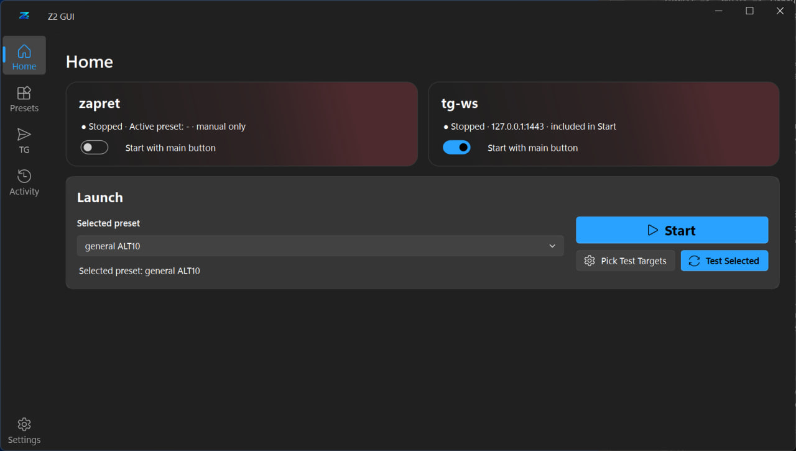
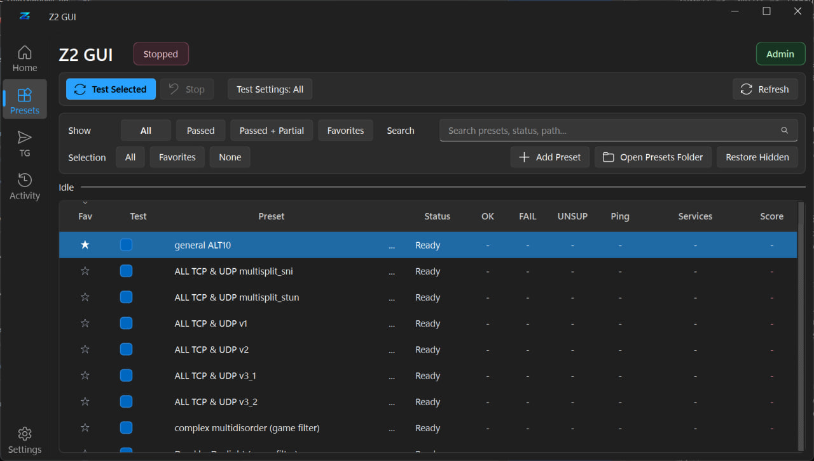
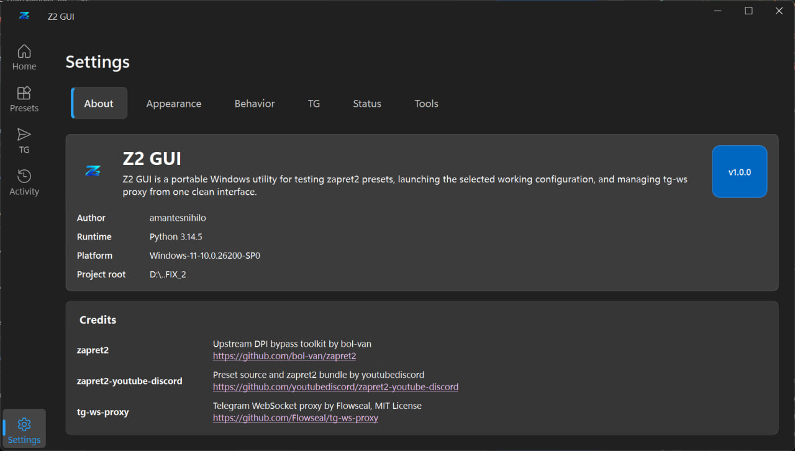

<div align="center">


# Z2 GUI

**Портативный Windows GUI для пресетов zapret2, автоматического тестирования, запуска в один клик и tg-ws-proxy.**

[](#требования)
[](#сборка-из-исходников)
[](#сборка-из-исходников)
[](#благодарности-и-лицензии)

Русский | [English](README.en.md)

</div>

Z2 GUI - портативное Windows-приложение для поиска, тестирования, сохранения и запуска пресетов zapret2 без ручного редактирования скриптов и запуска batch-файлов.

Также приложение включает интеграцию с `tg-ws-proxy` из исходного кода: Z2 GUI может запустить локальный Telegram MTProto WebSocket proxy, скопировать ссылку proxy и открыть ее прямо в Telegram Desktop.

## Скриншоты

| Home | Presets | Settings |
| --- | --- | --- |
|  |  |  |

## Что это такое

| Z2 GUI - это | Z2 GUI - это не |
| --- | --- |
| GUI-обертка вокруг пресетов zapret2 и инструментов запуска. | VPN или полноценный туннель всего трафика. |
| Локальный тестер и лаунчер пресетов. | Гарантия, что каждый сервис будет работать в любой сети. |
| Удобный способ управлять `winws2` и `tg-ws-proxy`. | Замена пониманию того, что вы запускаете на своем ПК. |

> [!IMPORTANT]
> Z2 GUI не является VPN. Он управляет локальными инструментами DPI-bypass и локальным Telegram proxy. Используйте его только там, где это разрешено правилами вашей сети и местным законодательством.

> [!WARNING]
> Для zapret нужны права администратора, потому что `winws2.exe` и WinDivert работают с сетевыми пакетами. Антивирусы могут эвристически помечать WinDivert, сетевые инструменты или сборки PyInstaller. Скачивайте сборки только из доверенных источников.

> [!CAUTION]
> Не запускайте неизвестные перепакованные сборки, если не доверяете распространителю. Портативная папка содержит исполняемые файлы, драйверные компоненты, пресеты, логи и локальные настройки.

## Содержание

- [Скриншоты](#скриншоты)
- [Возможности](#возможности)
- [Требования](#требования)
- [Быстрый старт](#быстрый-старт)
- [Права администратора](#права-администратора)
- [Тестирование пресетов](#тестирование-пресетов)
- [Избранное](#избранное)
- [tg-ws-proxy](#tg-ws-proxy)
- [Логи активности](#логи-активности)
- [Решение проблем](#решение-проблем)
- [Сборка из исходников](#сборка-из-исходников)
- [Структура проекта](#структура-проекта)
- [Заметки о безопасности](#заметки-о-безопасности)
- [Поддержать автора](#поддержать-автора)
- [Форки и атрибуция](#форки-и-атрибуция)
- [Благодарности и лицензии](#благодарности-и-лицензии)

## Возможности

| Область | Что делает Z2 GUI |
| --- | --- |
| Пресеты | Таблица пресетов, поиск, фильтры, избранное, пользовательские пресеты, скрытие/удаление. |
| Тестирование | Автоматические проверки выбранных пресетов через Discord, YouTube и другие настраиваемые цели. |
| Результаты | Последние результаты тестов восстанавливаются после перезапуска и сортируются по `Score`. |
| Запуск | Главная страница с избранными пресетами и единым сценарием Start / Stop. |
| tg-ws | Локальный Telegram MTProto WebSocket proxy с портом, secret, копированием ссылки, открытием в Telegram и перезапуском. |
| Активность | Отдельные консоли для логов zapret и tg-ws. |
| Безопасность | Проверка конфликтов VPN/proxy перед тестами и запуском. |
| UI | Интерфейс в стиле Fluent с темами Windows 11, Dark, AMOLED и Light. |
| Упаковка | Портативная сборка; Python на целевом ПК не требуется. |

## Требования

- Рекомендуется Windows 10/11.
- Права администратора для zapret / `winws2`.
- Telegram Desktop, если вы хотите использовать `tg-ws-proxy`.
- Доступ в интернет для реальных проверок целей.

> [!NOTE]
> Сам по себе `tg-ws-proxy` не требует прав администратора. Если запускать его вместе с zapret через кнопку на главной странице, приложение сначала проверяет права, чтобы избежать частичного запуска.

## Быстрый старт

1. Скачайте или соберите портативный пакет.
2. Откройте распакованную папку.
3. Запустите исполняемый файл. Windows должна автоматически показать UAC-запрос:

```text
Zapret2GUI.exe
```

4. Откройте `Presets` и добавьте один или несколько пресетов в избранное кнопкой со звездой.
5. Необязательно: запустите `Test Selected`, чтобы найти лучший пресет по `Score`.
6. Вернитесь на `Home`, выберите избранный пресет и нажмите `Start`.

> [!TIP]
> Home специально показывает только избранное. Это держит экран запуска чистым и защищает от случайного запуска из огромного списка пресетов.

## Права администратора

zapret2 использует `winws2.exe` и WinDivert. Эти инструменты просматривают и изменяют сетевые пакеты, поэтому Windows требует повышенные права.

Без прав администратора вы все равно можете открыть Z2 GUI, просматривать пресеты, менять настройки и настраивать tg-ws. Запуск или остановка zapret без повышения прав может завершиться ошибкой.

## Тестирование пресетов

1. Откройте `Presets`.
2. Выберите строки чекбоксами в колонке `Test`.
3. Откройте `Test Settings` и оставьте только нужные цели, например только Discord или только YouTube.
4. Нажмите `Test Selected`.
5. Следите за `Activity -> zapret`, пока идет тест.
6. Отсортируйте по `Score` и добавьте лучшие пресеты в избранное.

Колонки результатов:

| Колонка | Значение |
| --- | --- |
| OK | Успешные проверки целей. |
| FAIL | Неуспешные проверки. |
| UNSUP | Неподдерживаемые проверки. |
| Ping | Успешные проверки пинга / всего проверок пинга. |
| Score | Общая оценка пресета. Обычно чем выше, тем лучше. |

Последние результаты хранятся локально:

```text
utils/gui-results.json
```

## Избранное

Пресет становится избранным, когда вы нажимаете на звездочку в колонке `Fav`.

Избранное хранится локально:

```text
utils/gui-settings.json
```

В выпадающем списке пресетов на Home отображается только избранное.

## tg-ws-proxy

Z2 GUI включает интеграцию с `tg-ws-proxy` из исходного кода. Он запускается как helper-процесс Z2 GUI, а не как отдельный скачанный exe-файл.

### Как включить

1. Откройте `TG`.
2. Проверьте порт. Адрес по умолчанию:

```text
127.0.0.1:1443
```

3. Оставьте сгенерированный `Secret` или задайте свой 32-символьный hex secret.
4. Нажмите `Restart tg-ws`.
5. Нажмите `Open in Telegram` или `Copy proxy link`.

### Интеграция с Home

На странице Home есть карточка `tg-ws`. Переключатель `Start with main button` управляет тем, будет ли tg-ws запускаться общей кнопкой `Start`.

Можно запускать только zapret, только tg-ws или оба сразу.

### Логи

Файл лога tg-ws:

```text
utils/tg-ws-proxy.log
```

Его можно открыть со страницы `TG` или читать последние строки в `Activity -> tg-ws`.

## Логи активности

На странице `Activity` есть две консоли:

- `zapret` - события приложения, тесты пресетов, запуск/остановка winws2, проверки конфликтов;
- `tg-ws` - события tg-ws и последние строки из `utils/tg-ws-proxy.log`.

`Clear Log` очищает только выбранную в данный момент консоль.

## Решение проблем

| Проблема | Что сделать |
| --- | --- |
| zapret не запускается | Запустите Z2 GUI от администратора. |
| Пресет сразу завершается | Попробуйте другой пресет или проверьте файл пресета. |
| Тесты идут слишком долго | Откройте `Test Settings` и оставьте только нужные цели. |
| Discord или YouTube все равно не работает | Остановите текущий пресет, протестируйте несколько других, выберите пресет с более высоким `Score`. |
| Найден конфликт VPN/proxy | Закройте указанный клиент из диалога или вручную. VPN/proxy-клиенты часто перехватывают трафик и могут ломать zapret. |
| tg-ws не запускается | Проверьте, не занят ли порт `1443`, или смените порт на странице `TG`. |
| Telegram не открывает ссылку proxy | Используйте `Copy proxy link`, отправьте ссылку себе в Telegram и нажмите ее вручную. |
| Предупреждение антивируса | Проверьте исходники, при необходимости соберите сами, и помните, что WinDivert/сетевые инструменты часто помечаются эвристически. |

## Сборка из исходников

Установите зависимости:

```powershell
python -m pip install -r requirements.txt
```

Запуск из исходников:

```powershell
python .\gui\app.py
```

Сборка портативного пакета:

```powershell
powershell -NoProfile -ExecutionPolicy Bypass -File .\build-exe.ps1
```

Результат:

```text
dist/Zapret2GUI/Zapret2GUI.exe
```

Сохраняйте сгенерированную портативную папку целиком. Перемещение только `Zapret2GUI.exe` без вложенных файлов может сломать пресеты, WinDivert, иконки, логи, лицензии или интеграцию tg-ws.

## Структура проекта

```text
gui/                 GUI и логика приложения
gui/zapret_core/     пресеты, тестирование, winws2, менеджеры tg-ws
presets/             встроенные пресеты
utils/               настройки, результаты, логи, runtime-файлы
exe/                 файлы winws2 и WinDivert
vendor/              vendored-исходники сторонних компонентов
lists/               списки hosts/ip
lua/                 Lua-скрипты zapret
```

## Заметки о безопасности

Z2 GUI работает с сетевыми инструментами, поэтому относитесь к сборкам внимательно:

- предпочитайте официальные релизы или сборки, собранные самостоятельно;
- проверяйте, что портативная папка не была изменена неизвестной третьей стороной;
- ожидайте эвристические срабатывания антивирусов на WinDivert, `winws2`, packet tools или PyInstaller;
- закрывайте VPN/proxy-клиенты, если приложение сообщает о конфликте;
- не публикуйте свой `tg-ws` secret;
- проверяйте пользовательские пресеты перед добавлением.

## Поддержать автора

Если Z2 GUI оказался полезен, вы можете поддержать автора. Это необязательно, но помогает с временем на разработку, тестированием пресетов и поддержкой релизов.

| Способ | Реквизиты |
| --- | --- |
| Банковская карта | `4377 7278 0187 1414` - Daniil P. |
| Solana | `1hHoDcgWEWF96Yy97hes2gUoSkgANkAE1kNPnJ9Z9Uq` |
| Ethereum | `0x7B30eEE5C1625a754915cf761eD7D0DF24A97107` |
| Bitcoin | `bc1qv6x8677487qhkrz50mmx9ymsyagngzfp6fa58j` |

> [!NOTE]
> Перед отправкой чего-либо проверяйте платежные данные только в официальном README проекта или на странице релиза. Не доверяйте реквизитам из случайных перепакованных сборок.

## Форки и атрибуция

Если вы форкаете, перепаковываете, распространяете или публикуете измененную сборку Z2 GUI:

- оставляйте видимое указание на `Z2 GUI` и автора `amantesnihilo`;
- сохраняйте благодарности upstream-проектам, перечисленным ниже;
- не выдавайте чужую работу за свою;
- явно помечайте форк как измененный, если меняете поведение, пресеты, бинарники или встроенные компоненты;
- сохраняйте license-файлы и notices для встроенных сторонних проектов;
- не удаляйте предупреждения о правах администратора, WinDivert, реакциях антивирусов или конфликтах VPN/proxy;
- не публикуйте ребрендированную сборку так, чтобы скрывать оригинальный проект и upstream-авторов.

Хороший notice для форка выглядит так:

```text
Based on Z2 GUI by amantesnihilo.
Uses zapret2 by bol-van, zapret2-youtube-discord by youtubediscord,
and tg-ws-proxy by Flowseal.
```

Рекомендуемые места для атрибуции:

- README;
- экран About / Credits внутри приложения;
- страница релиза или описание архива;
- страница установщика, если вы делаете установщик.

## Благодарности и лицензии

Z2 GUI объединяет несколько upstream-проектов:

| Проект | Роль | Благодарность |
| --- | --- | --- |
| zapret2 | DPI-bypass toolkit / база winws2 | https://github.com/bol-van/zapret2 |
| zapret2-youtube-discord | источник пресетов и bundle zapret2 | https://github.com/youtubediscord/zapret2-youtube-discord |
| tg-ws-proxy | Telegram MTProto WebSocket proxy | Flowseal, MIT License, https://github.com/Flowseal/tg-ws-proxy |

Автор Z2 GUI: `amantesnihilo`.

См. также: [NOTICE.md](NOTICE.md).

Upstream-проекты сохраняют собственные лицензии и требования к атрибуции. Если вы распространяете сборку, держите их license-файлы и notices вместе с приложением.

> [!CAUTION]
> Проект предоставляется как есть. Вы сами отвечаете за то, как и где используете его. Тестируйте пресеты внимательно, храните резервные копии пользовательских пресетов и не запускайте неизвестные сборки из недоверенных источников.
